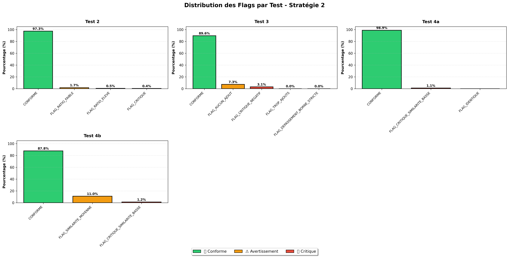

# Rapport de Validation Structurelle - Stratégie 2

**Date de génération:** 2026-01-24 02:23:51

---

## Résumé Exécutif

Ce rapport présente les résultats de la validation structurelle des graphes de gestes culinaires.
La Stratégie 2 évalue la cohérence structurelle des variantes de graphes à travers 6 tests complémentaires.

---

## Test 1 : Statistiques de Taille des Listes d'Actions

### 📊 Statistiques Globales

- **Total graphes analysés:** 2,563,467
- **Longueur moyenne:** 10.85 ± 6.15
- **Médiane:** 10.0
- **Min - Max:** [0, 1455]
- **Quartiles:** Q1 = 7.0, Q3 = 14.0
- **Outliers détectés:** 10,001 (0.39%)
- **Bornes:** [-14.0, 35.0]

### 📊 Statistiques par Variante

| Variante | Count | Moyenne ± σ | Médiane | Min | Max | Q1 | Q3 | Outliers | Outliers % |
|----------|-------|-------------|---------|-----|-----|----|----|----------|------------|
| variante_ingredients | 609,196 | 12.55 ± 7.02 | 11.0 | 0 | 1455 | 8.0 | 16.0 | 1,714 | 0.28% |
| variante_permutation | 935,984 | 10.57 ± 5.47 | 10.0 | 0 | 127 | 7.0 | 13.0 | 5,445 | 0.58% |
| variante_principale | 1,018,287 | 10.10 ± 5.99 | 9.0 | 0 | 932 | 6.0 | 13.0 | 4,116 | 0.40% |

### 📊 Statistiques par Catégorie de Cuisine

| Catégorie | Count | Moyenne ± σ | Médiane | Min | Max | Q1 | Q3 | Outliers | Outliers % |
|-----------|-------|-------------|---------|-----|-----|----|----|----------|------------|
| bakery | 672,974 | 11.45 ± 5.97 | 10.0 | 0 | 97 | 7.0 | 14.0 | 3,344 | 0.50% |
| other | 1,184,770 | 10.98 ± 6.11 | 10.0 | 0 | 832 | 7.0 | 14.0 | 4,892 | 0.41% |
| quick_prep | 425,331 | 8.96 ± 6.22 | 8.0 | 0 | 1455 | 5.0 | 12.0 | 896 | 0.21% |
| stew | 280,392 | 11.74 ± 6.08 | 11.0 | 0 | 840 | 8.0 | 15.0 | 987 | 0.35% |

### 📊 Statistiques par Niveau de Complexité

| Complexité | Count | Moyenne ± σ | Médiane | Min | Max | Q1 | Q3 | Outliers | Outliers % |
|------------|-------|-------------|---------|-----|-----|----|----|----------|------------|
| simple | 1,557,376 | 7.90 ± 3.54 | 8.0 | 0 | 676 | 5.0 | 10.0 | 643 | 0.04% |
| moyenne | 826,313 | 13.98 ± 4.76 | 13.0 | 0 | 955 | 11.0 | 16.0 | 1,898 | 0.23% |
| elevee | 179,778 | 22.11 ± 8.90 | 21.0 | 0 | 1455 | 17.0 | 26.0 | 728 | 0.40% |

---

## Test 2 : Variante Principale vs Nombre d'Instructions

- **Total variantes principales:** 1,018,287
- **Ratio moyen (actions/instructions):** 1.05
- **Ratio médian:** 1.00

### Distribution des Flags

| Flag | Count | Pourcentage |
|------|-------|-------------|
| ✅ CONFORME (0.5 ≤ ratio ≤ 2.5) | 991,268 | 97.35% |
| ⚠️ FLAG_RATIO_FAIBLE (0.3 ≤ ratio < 0.5) | 17,543 | 1.72% |
| ⚠️ FLAG_RATIO_ELEVE (2.5 < ratio ≤ 5.0) | 5,438 | 0.53% |
| ❌ FLAG_CRITIQUE (ratio < 0.3 ou > 5.0) | 4,038 | 0.40% |

---

## Test 3 : Variante Ingrédients

- **Total paires principale-ingrédients:** 608,997
- **Delta moyen:** 1.80
- **Delta médian:** 1.0
- **Delta [min, max]:** [-789, 1423]

### Distribution des Flags

| Flag | Count | Pourcentage |
|------|-------|-------------|
| ✅ CONFORME | 545,632 | 89.60% |
| ❌ FLAG_CRITIQUE_NEGATIF (delta < 0) | 18,954 | 3.11% |
| ⚠️ FLAG_AUCUN_AJOUT (delta == 0) | 44,293 | 7.27% |
| ⚠️ FLAG_TROP_AJOUTS (delta > nb_ingredients × 2) | 110 | 0.02% |
| ⚠️ FLAG_DEPASSEMENT_BORNE_STRICTE | 8 | 0.00% |

---

## Test 4A : Variante Permutation

- **Total paires principale-permutation:** 935,788

### Métriques de Similarité et d'Ordre

- **Jaccard (contenu):** Moyenne = 0.942, Min = 0.000, Max = 1.000
- **Levenshtein (ordre):** Moyenne = 2.7, Min = 1, Max = 876

### Distribution des Flags

| Flag | Count | Pourcentage |
|------|-------|-------------|
| ✅ CONFORME (overlap ∈ [0.6, 1.0] ET levenshtein > 0) | 925,398 | 98.89% |
| ❌ FLAG_CRITIQUE_SIMILARITE_BASSE (overlap < 0.6) | 10,390 | 1.11% |
| ⚠️ FLAG_IDENTIQUE (levenshtein = 0) | 0 | 0.00% |

---

## Test 4B : Similarité Variante Ingrédients

- **Total paires principale-ingrédients:** 608,997
- **Overlap moyen:** 0.827
- **Overlap médian:** 0.857
- **Overlap [min, max]:** [0.000, 1.000]

### Distribution des Flags

| Flag | Count | Pourcentage |
|------|-------|-------------|
| ✅ CONFORME (overlap ≥ 0.7) | 534,466 | 87.76% |
| ⚠️ FLAG_SIMILARITE_MOYENNE (0.5 ≤ overlap < 0.7) | 67,024 | 11.01% |
| ❌ FLAG_CRITIQUE_SIMILARITE_BASSE (overlap < 0.5) | 7,507 | 1.23% |

---

## Test 6 : Cohérence Globale par Recette

- **Total recettes analysées:** 1,018,486

### Distribution des Flags

---

## Visualisation des Flags

---

## Fichiers Générés

- **Dataset des flags critiques:** `dataset_flags_critique.csv`
- **Visualisation:** `flag_proportions_par_test.png`
- **Rapport complet:** `rapport_test_validation_structurelle.md`

---

## Conclusion et Recommandations

### Synthèse de la Validation

La Stratégie 2 a permis d'identifier les recettes avec des problèmes structurels critiques à travers 6 tests complémentaires:

1. **Test 1** : Statistiques descriptives complètes (par variante, catégorie, complexité)
2. **Test 2** : Validation du ratio actions/instructions
3. **Test 3** : Validation de l'ajout de gestes dans la variante ingrédients
4. **Test 4A** : Validation de la permutation (même ensemble)
5. **Test 4B** : Validation de la similarité variante ingrédients
6. **Test 6** : Cohérence globale par recette (présence variante principale)

### Actions Recommandées

1. **Recettes avec flags critiques** → Mise de côté pour retraitement ultérieur
2. **Recettes conformes** → Passage à la Stratégie 3 (Détection des Successions Illogiques)
3. **Recettes avec avertissements** → Examen manuel si temps disponible

---

*Rapport généré automatiquement le 2026-01-24 à 02:23:51*
