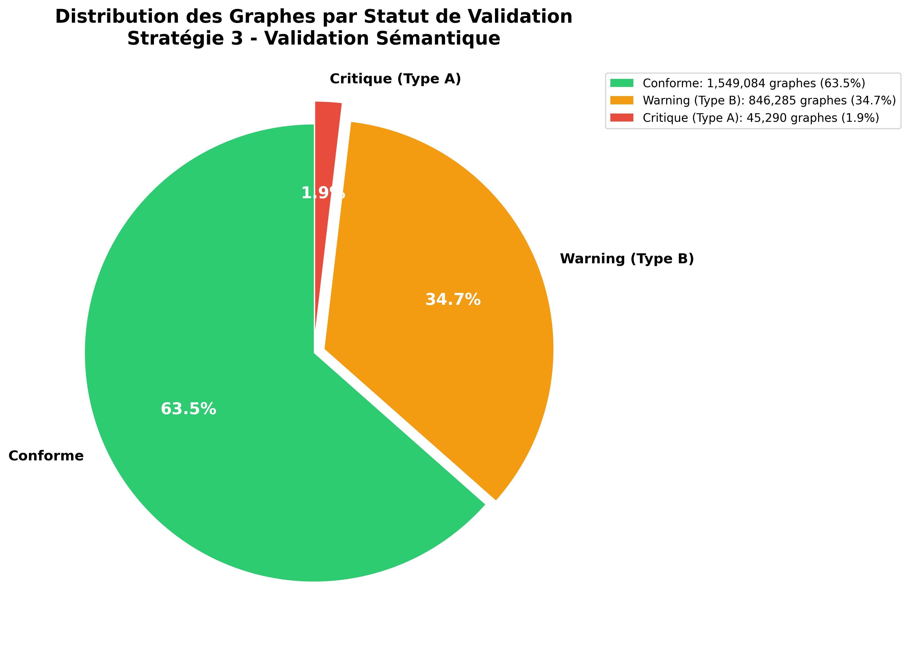
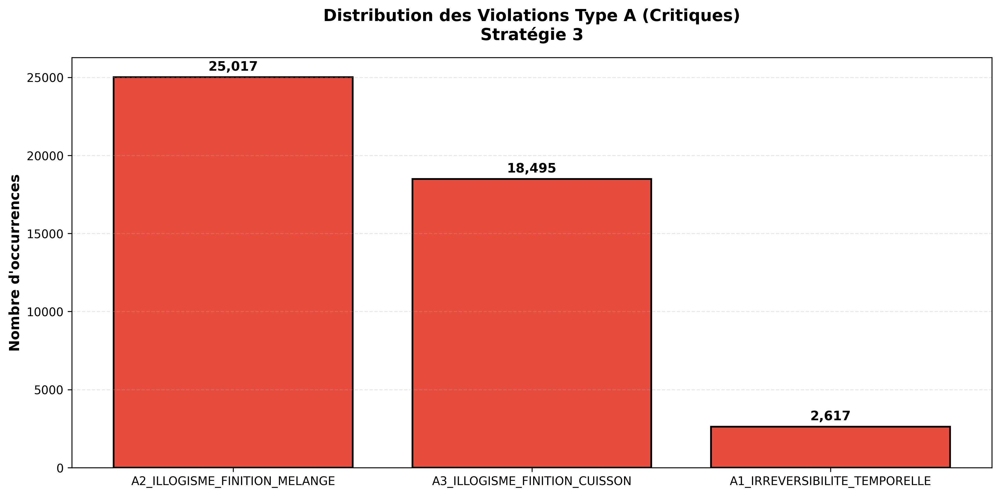
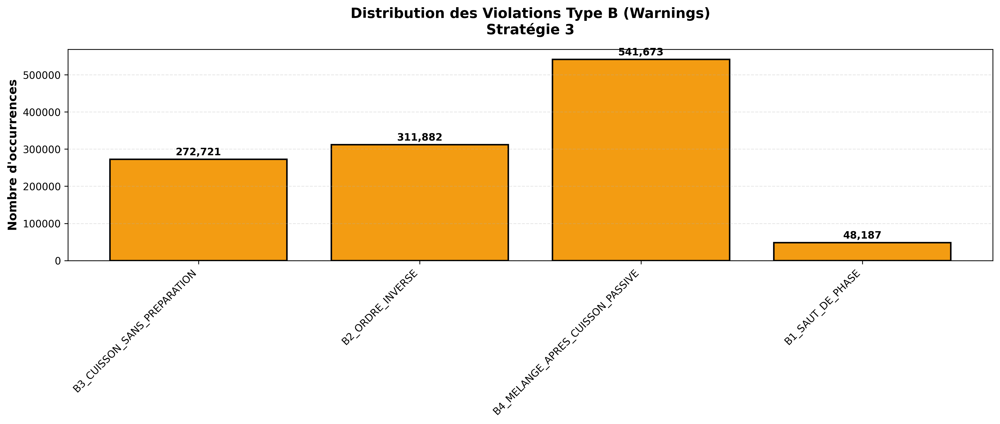

# Rapport de Validation Sémantique - Stratégie 3

**Date de génération:** 2026-01-24 03:16:05

---

## Introduction

Ce rapport présente les résultats de la validation sémantique des graphes de gestes culinaires.
La Stratégie 3 détecte les successions illogiques d'actions en utilisant une taxonomie de verbes et des règles de succession.

### Règles de Validation

**Règles Type A (Erreurs Critiques) - 3 règles:**

1. **A1_IRREVERSIBILITE_TEMPORELLE**: FINITION → PRÉPARATION INITIALE
2. **A2_ILLOGISME_FINITION_MELANGE**: FINITION → MÉLANGE
3. **A3_ILLOGISME_FINITION_CUISSON**: FINITION → CUISSON

**Règles Type B (Warnings) - 5 règles:**

1. **B1_SAUT_DE_PHASE**: PRÉPARATION → FINITION (sans étapes intermédiaires)
2. **B2_ORDRE_INVERSE**: TRANSFERT → TRANSFORMATION MÉCANIQUE
3. **B3_CUISSON_SANS_PREPARATION**: CUISSON comme première action
4. **B4_MELANGE_APRES_CUISSON_PASSIVE**: CUISSON PASSIVE → MÉLANGE
5. **B5_TRANSFORMATION_APRES_TRANSFERT_FINAL**: TRANSFERT → TRANSFORMATION

---

## Résultats Globaux

- **Total graphes analysés:** 2,466,296
- **Graphes conformes:** 1,549,084 (62.81%)
- **Graphes avec warnings (Type B uniquement):** 846,285 (34.31%)
- **Graphes avec erreurs critiques (Type A):** 45,290 (1.84%)

- **Total violations Type A:** 46,129
- **Total violations Type B:** 1,174,463
- **Total verbes inconnus:** 1
- **Total répétitions suspectes:** 23,442

---

## Visualisations

### Distribution Globale (Conforme / Warning / Critique)

### Distribution des Violations Type A (Critiques)

### Distribution des Violations Type B (Warnings)

---

## Détails des Violations Type A (Critiques)

| Règle | Occurrences |
|-------|-------------|
| A1_IRREVERSIBILITE_TEMPORELLE | 2,617 |
| A2_ILLOGISME_FINITION_MELANGE | 25,017 |
| A3_ILLOGISME_FINITION_CUISSON | 18,495 |

---

## Détails des Violations Type B (Warnings)

| Règle | Occurrences |
|-------|-------------|
| B1_SAUT_DE_PHASE | 48,187 |
| B2_ORDRE_INVERSE | 311,882 |
| B3_CUISSON_SANS_PREPARATION | 272,721 |
| B4_MELANGE_APRES_CUISSON_PASSIVE | 541,673 |

---

## Fichiers Générés

- `dataset_violations_semantiques.csv` - **Dataset principal des violations (id, flag)**
- `errors/type_a_violations.csv` - Violations Type A détaillées
- `errors/type_b_violations.csv` - Violations Type B détaillées
- `visualizations/pie_conforme_warning_critical.png` - Distribution globale
- `visualizations/bar_type_a_distribution.png` - Distribution Type A
- `visualizations/bar_type_b_distribution.png` - Distribution Type B
- `verb_taxonomy.json` - Taxonomie complète des verbes

---

## Conclusion et Recommandations

✅ **Excellente qualité sémantique** (<5% de violations critiques).

### Actions Recommandées

1. **Corriger toutes les violations Type A** (erreurs certaines)
2. **Examiner les violations Type B les plus fréquentes**
3. **Enrichir la taxonomie** avec les verbes inconnus fréquents
4. **Recettes avec violations critiques** → Mise de côté pour retraitement
5. **Recettes conformes** → Passage à la validation finale

---

*Rapport généré automatiquement le 2026-01-24 à 03:16:05*
