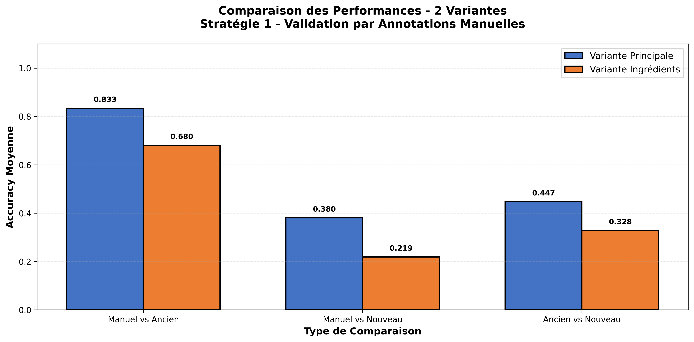

# Rapport de Validation par Annotations Manuelles - Stratégie 1

**Date de génération:** 2026-01-26 10:46:37
**Nombre de recettes analysées:** 10

---

## Introduction

Ce rapport présente les résultats de la validation de la qualité des annotations LLM
par comparaison avec des annotations manuelles (référence gold standard).

**Comparaisons effectuées:**
- **Manuel vs Ancien**: Performance du système LLM initial
- **Manuel vs Nouveau**: Performance du système LLM amélioré
- **Ancien vs Nouveau**: Évolution entre les deux systèmes

**Variantes analysées:**
- Variante Principale
- Variante Ingrédients

---

## Visualisation Globale

---

## Métriques - Variante Principale

### Métriques Moyennes

| Comparaison | Exact Match | Accuracy | Jaccard | Levenshtein | LCS Ratio |
|-------------|-------------|----------|---------|-------------|-----------|
| Manuel vs Ancien | 80.0% | 0.833 | 0.886 | 1.1 | 0.878 |
| Manuel vs Nouveau | 0.0% | 0.380 | 0.580 | 5.2 | 0.616 |
| Ancien vs Nouveau | 0.0% | 0.447 | 0.641 | 4.8 | 0.664 |

### Distribution des Changements (Ancien → Nouveau)

| Catégorie | Count | Pourcentage |
|-----------|-------|-------------|
| correction | 0 | 0.0% |
| regression | 8 | 80.0% |
| stable_correct | 0 | 0.0% |
| stable_incorrect | 0 | 0.0% |
| changement_lateral | 2 | 20.0% |

---

## Métriques - Variante Ingrédients

### Métriques Moyennes

| Comparaison | Exact Match | Accuracy | Jaccard | Levenshtein | LCS Ratio |
|-------------|-------------|----------|---------|-------------|-----------|
| Manuel vs Ancien | 50.0% | 0.598 | 0.844 | 1.4 | 0.854 |
| Manuel vs Nouveau | 0.0% | 0.228 | 0.559 | 6.4 | 0.600 |
| Ancien vs Nouveau | 0.0% | 0.328 | 0.659 | 5.7 | 0.691 |

### Distribution des Changements (Ancien → Nouveau)

| Catégorie | Count | Pourcentage |
|-----------|-------|-------------|
| correction | 0 | 0.0% |
| regression | 5 | 50.0% |
| stable_correct | 0 | 0.0% |
| stable_incorrect | 0 | 0.0% |
| changement_lateral | 5 | 50.0% |

---

## Fichiers Générés

- `echantillon_annotation_manuelle.xlsx` - Fichier Excel pour annotations manuelles
- `comparison_metrics_principale.csv` - Métriques détaillées variante principale
- `comparison_metrics_ingredients.csv` - Métriques détaillées variante ingrédients
- `visualizations/comparison_summary.png` - Graphique résumé des comparaisons
- `rapport_validation_annotations.md` - Ce rapport

---

## Conclusion

⚠️ **Variante Principale**: Régression détectée (-0.453 accuracy)
⚠️ **Variante Ingrédients**: Régression détectée (-0.370 accuracy)

---

*Rapport généré automatiquement le 2026-01-26 à 10:46:37*
